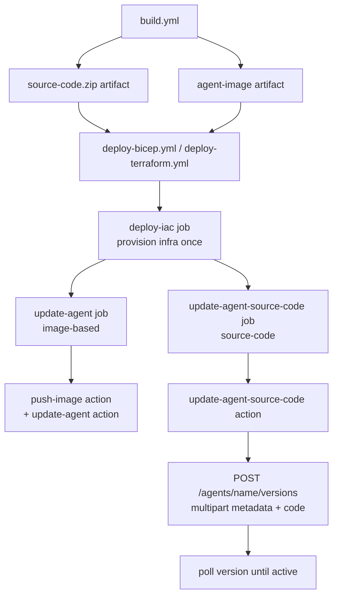

# Deploying Source Code

This guide covers the repository's ZIP-based hosted-agent deployment path. Unlike the container-image path — which builds and pushes a Docker image to ACR — this path uploads a flat source-code `.zip` and a separate metadata payload directly to the Foundry data plane.

Use this guide when you want to demo the source-code deployment experience for Hosted agents without building and pushing a container image yourself.

For the official REST reference, see [Deploy a hosted agent from source code (preview)](https://learn.microsoft.com/en-us/azure/foundry/agents/how-to/deploy-hosted-agent-code?tabs=bash). For the container/image workflow in this repo, see [Deploying with Bicep](./deploy-bicep.md), [Deploying with Terraform](./deploy-terraform.md), and [GitHub Actions CI/CD](./github-actions.md).

---

## What This Repo Supports

This repository demonstrates source-code deployment through two surfaces:

**1. GitHub Actions** — source-code deployment runs as a parallel job inside the same provider workflow that runs the image deployment, so a single push to `main` deploys both shapes of the agent.

| Workflow / action | Purpose |
|---|---|
| `.github/workflows/deploy-bicep.yml` | Provision Bicep infrastructure, then fan out to image-based and source-code agent updates in parallel |
| `.github/workflows/deploy-terraform.yml` | Provision Terraform infrastructure, then fan out to image-based and source-code agent updates in parallel |
| `.github/actions/update-agent-source-code/action.yml` | Upload the source-code zip plus multipart metadata to the Foundry data plane |

**2. Local shell scripts** — `deploy-bicep.sh` and `deploy-terraform.sh` accept feature flags so you can deploy either or both agent shapes from your workstation. See [Local shell script support](#local-shell-script-support) below.

The build workflow creates the artifact consumed by the source-code job in either provider workflow:

| Artifact | Produced by | Contents |
|---|---|---|
| `source-code` | `.github/workflows/build.yml` | A flat `source-code.zip` generated from `src/agent-framework/responses/basic/` |

---

## Why This Path Is Different

The ZIP-based path uses a different API contract from the image-based Hosted agent path.

| Deployment mode | Request shape | Key fields |
|---|---|---|
| Image-based | Single JSON POST to `/agents/{name}/versions` | `image`, CPU, memory, protocol, environment variables |
| Source-code | Multipart form upload to `/agents/{name}/versions` | `metadata` JSON part, `code` zip part, SHA-256 header |

The source-code action creates a temporary metadata file because the preview API expects two separate multipart form parts:

1. `metadata` — the agent definition JSON
2. `code` — the raw zip payload

The current action in this repo exposes `cpu`, `memory`, `runtime`, `entry_point`, and `max_polling_seconds` as optional inputs. With the current defaults, the metadata is:

- `kind: hosted`
- `protocol_versions: [{ protocol: responses, version: 1.0.0 }]`
- `cpu: 0.25`
- `memory: 0.5Gi`
- `code_configuration.runtime: python_3_13`
- `code_configuration.entry_point: ["python", "main.py"]`
- `code_configuration.dependency_resolution: remote_build`
- `environment_variables.AZURE_AI_MODEL_DEPLOYMENT_NAME`

> `code_configuration` and the image/container deployment shape are different modes. They are not alternative fields on the same request.

---

## Prerequisites

| Requirement | Notes |
|---|---|
| A Foundry project in a supported region | Created by the Bicep or Terraform workflows |
| GitHub Actions OIDC setup | Same secrets, variables, and RBAC model as [GitHub Actions CI/CD](./github-actions.md) |
| Foundry Project Manager at project scope | Required to create or update Hosted agent versions |
| Azure CLI access token for `https://ai.azure.com/` | Acquired inside the composite action |

The source-code deployment workflows inherit the same authentication model as the other deployment workflows in this repository:

- `AZURE_CLIENT_ID`
- `AZURE_TENANT_ID`
- `AZURE_SUBSCRIPTION_ID`

For Terraform, the workflow also uses the same optional backend variables documented in [GitHub Actions CI/CD](./github-actions.md).

---

## How The ZIP Is Built

The reusable build workflow creates `source-code.zip` from `src/agent-framework/responses/basic/` and uploads it as the `source-code` artifact.

The workflow uses `git archive --format=zip HEAD:src/agent-framework/responses/basic`, so the archive contains the tracked files from that directory with no wrapping parent folder. For this sample, the important files are:

```text
source-code.zip
├── README.md
├── main.py
├── requirements.txt
├── Dockerfile
├── agent.yaml
└── agent.manifest.yaml
```

For the current Python `remote_build` configuration, the important runtime files are `main.py` and `requirements.txt`. The Microsoft preview documentation calls out the same minimum flat ZIP layout for Python source-code deployment.

> The ZIP must not wrap the files in a top-level folder. `main.py` must be at the root of the archive for the current `entry_point` to work.

> Because the archive is built with `git archive`, only tracked files from `src/agent-framework/responses/basic/` are included.

---

## Deployment Flow



Within each provider workflow, `deploy-iac` runs once and its outputs (`project_endpoint`, `acr_endpoint`, `model_deployment_name`) are shared with the two downstream agent-update jobs running in parallel. See [GitHub Actions CI/CD](./github-actions.md) for the full orchestration diagram.

### Step 1 — Build the source-code artifact

`.github/workflows/build.yml` builds `source-code.zip` in the dedicated `source-code` job and uploads it as the `source-code` artifact. That job runs in parallel with the Docker image build job.

### Step 2 — Provision infrastructure

The source-code deployment workflow runs either:

- `.github/actions/deploy-bicep`
- `.github/actions/deploy-terraform`

Both surface the same outputs needed by the source-code action:

- `project_endpoint`
- `model_deployment_name`

### Step 3 — Upload metadata and code

`.github/actions/update-agent-source-code/action.yml`:

1. builds a temporary metadata JSON file,
2. computes `sha256sum` for the zip,
3. acquires a token for `https://ai.azure.com/`,
4. sends a multipart `POST` to:

```text
{projectEndpoint}/agents/{agentName}/versions?api-version=2025-11-15-preview
```

The `/versions` endpoint auto-creates the agent if it does not exist and creates a new version if it does. This matches the image-based `update-agent` action while preserving the source-code multipart payload shape.

The action sends these preview headers:

- `Authorization: Bearer <token>`
- `Accept: application/json`
- `Foundry-Features: CodeAgents=V1Preview,HostedAgents=V1Preview`
- `x-ms-agent-name: <agent-name>`
- `x-ms-code-zip-sha256: <zip-sha256>`

### Step 4 — Poll until active

After the create call returns, the action polls:

```text
{projectEndpoint}/agents/{agentName}/versions/{version}?api-version=2025-11-15-preview
```

The action stops when the version reaches:

- `active` — deployment succeeded
- `failed` — deployment failed
- timeout — controlled by `max_polling_seconds` (default `600`)

---

## Workflow Inputs

The consolidated provider workflows (`deploy-bicep.yml` and `deploy-terraform.yml`) take a single `agent_name` input. Inside each workflow the source-code job appends `-src` (for example `agent-framework-agent-basic-responses-src`) so the source-code agent does not collide with the image-based agent registered under the same name in the same Foundry project.

### Bicep provider workflow

`.github/workflows/deploy-bicep.yml` accepts:

| Input | Purpose |
|---|---|
| `agent_name` | Foundry Hosted agent name (the source-code job uses `${agent_name}-src`) |
| `environment_name` | Bicep deployment label |
| `location` | Resource group / deployment region |
| `ai_deployments_location` | AI model deployment region |

### Terraform provider workflow

`.github/workflows/deploy-terraform.yml` accepts the same inputs as the Bicep workflow and also passes the optional `TF_BACKEND_*` repository variables to the Terraform composite action.

### How This Wires Into ci-cd.yml

`ci-cd.yml` invokes `deploy-bicep` and `deploy-terraform` once each. Each call provisions infrastructure once and then runs the image and source-code agent updates in parallel — so a single push to `main` deploys both agent shapes for both providers into their respective Foundry projects. `agent_name`, `environment_name`, `location`, and `ai_deployments_location` are passed through from repository variables or `workflow_dispatch` inputs unchanged; the `-src` suffix for the source-code variant is added inside the provider workflow.

---

## How This Compares To The Microsoft REST Examples

The Microsoft preview article documents separate create and update/version operations. This repository uses the version endpoint for both first deploys and later updates:

- `POST /agents/{name}/versions?api-version=2025-11-15-preview`
- includes `x-ms-agent-name`
- uploads `metadata` and `code`
- polls the returned version until `active`

Live validation showed this endpoint auto-creates the source-code agent when it is missing and returns a normal agent-version response with a top-level `version` field. That keeps the source-code action aligned with the image-based `update-agent` action.

---

## Local shell script support

Both `deployment/deploy-bicep.sh` and `deployment/deploy-terraform.sh` deploy the image-based agent **and** the source-code agent by default. Each can be turned off independently with a CLI flag or environment variable.

### Flags

| Flag | Environment variable | Default | Effect |
|---|---|---|---|
| `--no-image-agent` | `IMAGE_BASED_AGENT=false` | `true` | Skip the image build, push, and image-based agent POST |
| `--no-source-code-agent` | `SOURCE_CODE_BASED_AGENT=false` | `true` | Skip the source-code zip + multipart POST |
| `--skip-rbac` | `SKIP_RBAC=true` | `false` | Skip the Foundry Project Manager role assignment and 120-second RBAC propagation wait |

CLI flags override environment variables. The script errors out if both flags resolve to `false`.

### Examples

```bash
# Deploy both agents (default)
./deployment/deploy-bicep.sh

# Only the image-based agent
./deployment/deploy-bicep.sh --no-source-code-agent

# Only the source-code agent (skip Docker entirely)
./deployment/deploy-bicep.sh --no-image-agent

# Iterate on source code without re-provisioning infra
./deployment/deploy-bicep.sh --skip-infra --no-image-agent

# Iterate after RBAC is already assigned
./deployment/deploy-bicep.sh --skip-infra --skip-rbac --no-image-agent

# Same flags exist on the Terraform script
./deployment/deploy-terraform.sh --no-image-agent
```

### What the source-code path does locally

1. Acquires a Foundry data-plane token (`https://ai.azure.com/`).
2. Builds `source-code.zip` with `git archive --format=zip HEAD:src/agent-framework/responses/basic` so the zip is byte-identical to the CI artifact produced by `build.yml`.
3. Computes the zip `sha256sum`.
4. Writes the metadata JSON (`code_configuration.runtime: python_3_13`, `entry_point: ["python", "main.py"]`, `dependency_resolution: remote_build`).
5. POSTs a multipart request to `{projectEndpoint}/agents/{name}/versions?api-version=2025-11-15-preview` with the preview headers (`Foundry-Features`, `x-ms-agent-name`, `x-ms-code-zip-sha256`).
6. Polls `{projectEndpoint}/agents/{name}/versions/{version}` until status is `active` or `failed`, or until `SOURCE_CODE_MAX_POLLING_SECONDS` (default `600`) elapses.

The image-based agent uses `${AGENT_NAME}`; the source-code agent uses `${AGENT_NAME}-src` — the same convention as `ci-cd.yml`.

### Why not azd?

The `azd` flow is intentionally **not** extended to cover source-code agents. azd delegates agent creation to the `azure.ai.agents` extension, which owns the data-plane POST and only knows the image-based shape. Adding source-code support there would require either replacing the extension, layering a fragile `postdeploy` hook that rewrites the agent definition after azd has already created the image-based version, or maintaining a fork of the extension. The shell scripts already own the full deploy pipeline end-to-end, so adding a second POST in the same script is a cheap, contained change with no extension assumptions to fight.

If you need the source-code path and are using azd today, run `./deployment/deploy-bicep.sh --skip-infra --no-image-agent` (or the Terraform equivalent) after `azd up` to layer the source-code agent on top of the azd-provisioned infrastructure.

---

## When To Use This Path

- Use ZIP-based source-code deployment for demos of the preview Hosted agent source-code experience.
- Use it when you want to avoid a container build-and-push loop for small code changes.
- Use the image-based path when you need full control over the runtime image or want parity with the existing local shell-script workflows.

---

## Related Documentation

- [GitHub Actions CI/CD](./github-actions.md)
- [Deploying with Bicep](./deploy-bicep.md)
- [Deploying with Terraform](./deploy-terraform.md)
- [Deploy a hosted agent from source code (preview)](https://learn.microsoft.com/en-us/azure/foundry/agents/how-to/deploy-hosted-agent-code?tabs=bash)
- [Deploy a hosted agent (container)](https://learn.microsoft.com/en-us/azure/foundry/agents/how-to/deploy-hosted-agent)