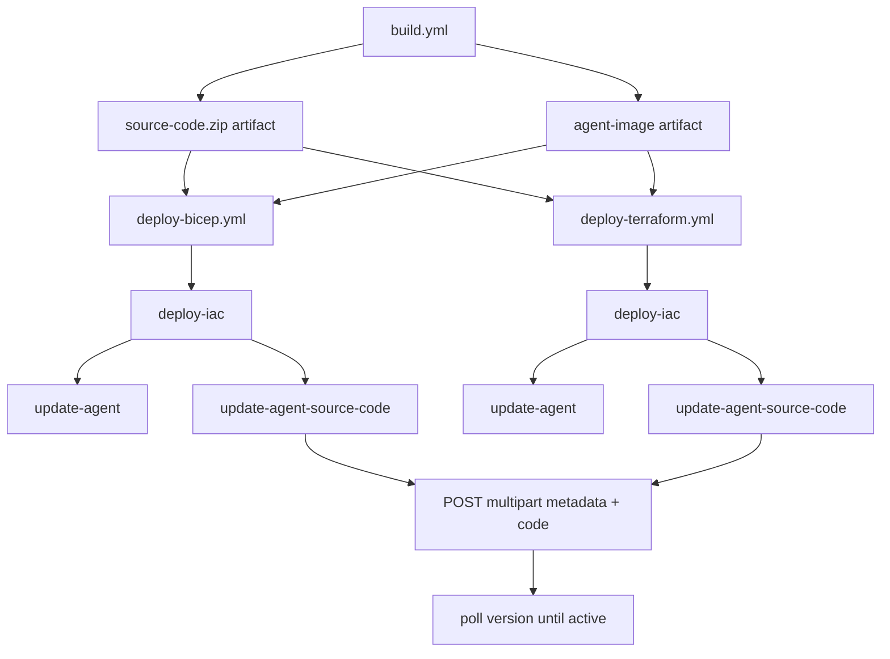

# Deploying Source Code

This guide covers the repository's ZIP-based hosted-agent deployment path. Unlike the local Bicep and Terraform shell scripts, which deploy a container image, this path uploads a flat source-code `.zip` and a separate metadata payload through GitHub Actions.

Use this guide when you want to demo the new source-code deployment experience for Hosted agents without building and pushing a container image.

For the official REST reference, see [Deploy a hosted agent from source code (preview)](https://learn.microsoft.com/en-us/azure/foundry/agents/how-to/deploy-hosted-agent-code?tabs=bash). For the container/image workflow in this repo, see [Deploying with Bicep](./deploy-bicep.md), [Deploying with Terraform](./deploy-terraform.md), and [GitHub Actions CI/CD](./github-actions.md).

---

## What This Repo Supports

This repository currently demonstrates source-code deployment through GitHub Actions reusable workflows:

| Workflow | Purpose |
|---|---|
| `.github/workflows/deploy-bicep.yml` | Provision infrastructure with Bicep, then update image-based and source-code agents in parallel |
| `.github/workflows/deploy-terraform.yml` | Provision infrastructure with Terraform, then update image-based and source-code agents in parallel |
| `.github/actions/update-agent-source-code/action.yml` | Upload the source-code zip plus multipart metadata to the Foundry data plane |

The build workflow creates the artifact consumed by both source-code deployment workflows:

| Artifact | Produced by | Contents |
|---|---|---|
| `source-code` | `.github/workflows/build.yml` | A flat `source-code.zip` generated from `src/agent-framework/responses/basic/` |

---

## Why This Path Is Different

The ZIP-based path uses a different API contract from the image-based Hosted agent path.

| Deployment mode | Request shape | Key fields |
|---|---|---|
| Image-based | Single JSON POST | `image`, CPU, memory, protocol, environment variables |
| Source-code | Multipart form upload | `metadata` JSON part, `code` zip part, SHA-256 header |

The source-code action creates a temporary metadata file because the preview API expects two separate multipart form parts:

1. `metadata` — the agent definition JSON
2. `code` — the raw zip payload

The current action in this repo exposes `cpu`, `memory`, `runtime`, `entry_point`, and `max_polling_seconds` as optional inputs. With the current defaults, the metadata is:

- `kind: hosted`
- `protocol_versions: [{ protocol: responses, version: 1.0.0 }]`
- `cpu: 0.25`
- `memory: 0.5Gi`
- `code_configuration.runtime: python_3_13`
- `code_configuration.entry_point: ["python", "main.py"]`
- `code_configuration.dependency_resolution: remote_build`
- `environment_variables.AZURE_AI_MODEL_DEPLOYMENT_NAME`

> `code_configuration` and the image/container deployment shape are different modes. They are not alternative fields on the same request.

---

## Prerequisites

| Requirement | Notes |
|---|---|
| A Foundry project in a supported region | Created by the Bicep or Terraform workflows |
| GitHub Actions OIDC setup | Same secrets, variables, and RBAC model as [GitHub Actions CI/CD](./github-actions.md) |
| Foundry Project Manager at project scope | Required to create or update Hosted agent versions |
| Azure CLI access token for `https://ai.azure.com/` | Acquired inside the composite action |

The source-code deployment workflows inherit the same authentication model as the other deployment workflows in this repository:

- `AZURE_CLIENT_ID`
- `AZURE_TENANT_ID`
- `AZURE_SUBSCRIPTION_ID`

For Terraform, the workflow also uses the same optional backend variables documented in [GitHub Actions CI/CD](./github-actions.md).

---

## How The ZIP Is Built

The reusable build workflow creates `source-code.zip` from `src/agent-framework/responses/basic/` and uploads it as the `source-code` artifact.

The workflow uses `git archive --format=zip HEAD:src/agent-framework/responses/basic`, so the archive contains the tracked files from that directory with no wrapping parent folder. For this sample, the important files are:

```text
source-code.zip
├── README.md
├── main.py
├── requirements.txt
├── Dockerfile
├── agent.yaml
└── agent.manifest.yaml
```

For the current Python `remote_build` configuration, the important runtime files are `main.py` and `requirements.txt`. The Microsoft preview documentation calls out the same minimum flat ZIP layout for Python source-code deployment.

> The ZIP must not wrap the files in a top-level folder. `main.py` must be at the root of the archive for the current `entry_point` to work.

> Because the archive is built with `git archive`, only tracked files from `src/agent-framework/responses/basic/` are included.

---

## Deployment Flow



In `ci-cd.yml`, the two deploy workflows (`deploy-bicep` and `deploy-terraform`) run in parallel after `build`. Inside each reusable workflow, `update-agent-source-code` runs in parallel with `update-agent` after a shared `deploy-iac` job. See [GitHub Actions CI/CD](./github-actions.md) for the full orchestration diagram.

### Step 1 — Build the source-code artifact

`.github/workflows/build.yml` builds `source-code.zip` in the dedicated `source-code` job and uploads it as the `source-code` artifact. That job runs in parallel with the Docker image build job.

### Step 2 — Provision infrastructure

The source-code deployment workflow runs either:

- `.github/actions/deploy-bicep`
- `.github/actions/deploy-terraform`

Both surface the same outputs needed by the source-code action:

- `project_endpoint`
- `model_deployment_name`

### Step 3 — Upload metadata and code

`.github/actions/update-agent-source-code/action.yml`:

1. builds a temporary metadata JSON file,
2. computes `sha256sum` for the zip,
3. acquires a token for `https://ai.azure.com/`,
4. sends a multipart `POST` to:

```text
{projectEndpoint}/agents?api-version=2025-11-15-preview
```

The action sends these preview headers:

- `Authorization: Bearer <token>`
- `Accept: application/json`
- `Foundry-Features: CodeAgents=V1Preview,HostedAgents=V1Preview`
- `x-ms-agent-name: <agent-name>`
- `x-ms-code-zip-sha256: <zip-sha256>`

### Step 4 — Poll until active

After the create call returns, the action polls:

```text
{projectEndpoint}/agents/{agentName}/versions/{version}?api-version=2025-11-15-preview
```

The action stops when the version reaches:

- `active` — deployment succeeded
- `failed` — deployment failed
- timeout — controlled by `max_polling_seconds` (default `600`)

---

## Workflow Inputs

> In both reusable deploy workflows, the source-code update step calls `update-agent-source-code` with `agent_name: ${{ inputs.agent_name }}-src` so the source-code agent does not collide with the image-based agent in the same Foundry project. With default values, that becomes `agent-framework-agent-basic-responses-src`.

### Bicep source-code workflow

`.github/workflows/deploy-bicep.yml` accepts:

| Input | Purpose |
|---|---|
| `agent_name` | Foundry Hosted agent name |
| `image_name` | Container image name for the image-based path |
| `image_tag` | Container image tag produced by `build.yml` |
| `environment_name` | Bicep deployment label |
| `location` | Resource group / deployment region |
| `ai_deployments_location` | AI model deployment region |

### Terraform source-code workflow

`.github/workflows/deploy-terraform.yml` accepts:

| Input | Purpose |
|---|---|
| `agent_name` | Foundry Hosted agent name |
| `image_name` | Container image name for the image-based path |
| `image_tag` | Container image tag produced by `build.yml` |
| `environment_name` | Terraform environment name |
| `location` | Resource group / deployment region |
| `ai_deployments_location` | AI model deployment region |

The Terraform workflow also passes the optional `TF_BACKEND_*` repository variables to the Terraform composite action, exactly like the image-based deployment workflow.

### How This Wires Into ci-cd.yml

`ci-cd.yml` invokes `deploy-bicep.yml` and `deploy-terraform.yml` as jobs `deploy-bicep` and `deploy-terraform`, both with `needs: build`. Each reusable workflow then performs a shared IaC deploy and publishes both deployment modes (image-based and source-code) in parallel, so a single push to `main` updates both agents in the same Foundry project.

---

## How This Compares To The Microsoft REST Examples

The Microsoft preview article documents both create and update/version operations.

This repository currently implements the create-style flow:

- `POST /agents?api-version=2025-11-15-preview`
- includes `x-ms-agent-name`
- uploads `metadata` and `code`
- polls the resulting version until `active`

The same Microsoft article also documents the update/version flow:

- `POST /agents/{name}?api-version=2025-11-15-preview`
- same multipart request body
- no `x-ms-agent-name` header needed because the agent name is already in the URL

If this repository evolves from first-create demos to repeated code updates of an existing source-code agent, the action will likely need to move from the create-style endpoint to the update/version endpoint.

---

## When To Use This Path

- Use ZIP-based source-code deployment for demos of the preview Hosted agent source-code experience.
- Use it when you want to avoid a container build-and-push loop for small code changes.
- Use the image-based path when you need full control over the runtime image or want parity with the existing local shell-script workflows.

---

## Related Documentation

- [GitHub Actions CI/CD](./github-actions.md)
- [Deploying with Bicep](./deploy-bicep.md)
- [Deploying with Terraform](./deploy-terraform.md)
- [Deploy a hosted agent from source code (preview)](https://learn.microsoft.com/en-us/azure/foundry/agents/how-to/deploy-hosted-agent-code?tabs=bash)
- [Deploy a hosted agent (container)](https://learn.microsoft.com/en-us/azure/foundry/agents/how-to/deploy-hosted-agent)