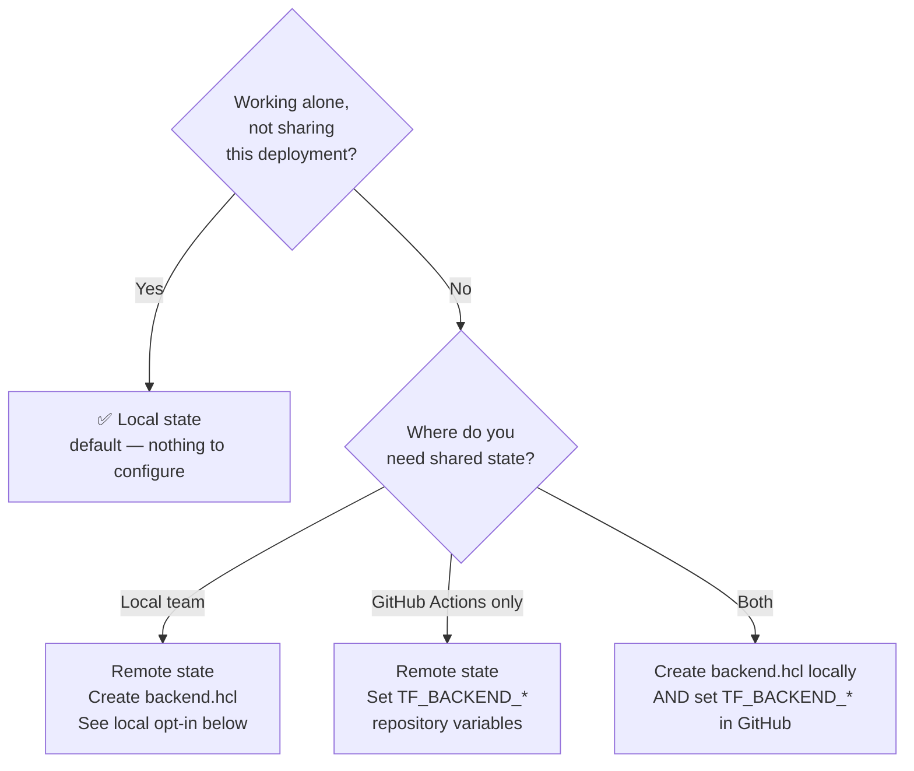

# Deploying with Terraform

This guide covers local deployment of the simple-hosted-agent using Terraform (azapi provider) via the shell script and the Azure Developer CLI (`azd`). For CI/CD automation, see [GitHub Actions](./github-actions.md).

---

## Prerequisites

| Tool | Notes |
|---|---|
| [Azure CLI](https://learn.microsoft.com/cli/azure/install-azure-cli) | Required for all paths. Run `az login` before deploying. |
| [Terraform](https://developer.hashicorp.com/terraform/install) | Version ≥ 1.9. `brew install hashicorp/tap/terraform` / [installer](https://developer.hashicorp.com/terraform/install). |
| [Docker Desktop](https://www.docker.com/products/docker-desktop/) | Required when deploying the image-based agent. Not required for source-code-only deploys. |

All prerequisites are pre-installed in the dev container.

---

## Configuration

Edit `infra/terraform/terraform.tfvars` to match your environment:

```hcl
environment_name        = "simple-hosted-agent-tf"    # Used in resource naming
resource_group_name     = "rg-simple-hosted-agent-tf" # Resource group to create
location                = "swedencentral"              # Region for the resource group
ai_deployments_location = "swedencentral"              # Region for model deployments (may differ)
ai_foundry_project_name = "ai-project-tf"              # Foundry project name

deployments = [
  {
    name = "gpt-4.1-mini"
    model = {
      format  = "OpenAI"
      name    = "gpt-4.1-mini"
      version = "2025-04-14"
    }
    sku = { name = "Standard", capacity = 10 }
  }
]
```

`location` and `ai_deployments_location` must be regions that support Foundry hosted agents. See the [availability table](https://learn.microsoft.com/azure/foundry/agents/concepts/hosted-agents#limits-pricing-and-availability-preview).

> **The `-tf` suffix convention:** `terraform.tfvars` uses `simple-hosted-agent-tf` as the environment name. This prevents resource name collisions if you deploy both the Bicep and Terraform configurations to the same subscription, since both derive resource names from their respective environment name.

Also edit the configuration block at the top of `deployment/deploy-terraform.sh`:

```bash
AGENT_NAME="agent-framework-agent-basic-responses-tf"  # Name for the hosted agent in Foundry
IMAGE_NAME="agent-framework-agent-basic-responses"      # Container image name (without registry/tag)
```

---

## Shell Script

`deployment/deploy-terraform.sh` runs the full deployment from your local machine in eight steps. By default, it deploys both the image-based agent and the source-code agent, then runs a post-deploy smoke test against each.

### Usage

```bash
# Full deploy — infrastructure + image-based agent + source-code agent + smoke tests
./deployment/deploy-terraform.sh

# Code-only update — skip infrastructure, update both agents
./deployment/deploy-terraform.sh --skip-infra

# Only the image-based agent
./deployment/deploy-terraform.sh --no-source-code-agent

# Only the source-code agent — skips Docker entirely
./deployment/deploy-terraform.sh --no-image-agent

# Skip the Foundry Project Manager grant and 120s RBAC wait
./deployment/deploy-terraform.sh --skip-rbac

# Skip post-deploy smoke tests
./deployment/deploy-terraform.sh --no-smoke-test
```

> Run from anywhere in the repo. The script resolves the repo root from its own location.

### Flags and environment variables

| Flag | Environment variable | Default | Effect |
|---|---|---|---|
| `--no-image-agent` | `IMAGE_BASED_AGENT=false` | `true` | Skip ACR login, Docker build/push, and image-based agent version creation |
| `--no-source-code-agent` | `SOURCE_CODE_BASED_AGENT=false` | `true` | Skip source-code zip creation, multipart upload, and remote-build polling |
| `--skip-rbac` | `SKIP_RBAC=true` | `false` | Skip the Foundry Project Manager role assignment and the 120-second RBAC propagation wait |
| `--no-smoke-test` | `SMOKE_TEST=false` | `true` | Skip Step 8 (post-deploy smoke tests). See [Smoke tests](./smoke-tests.md). |

CLI flags override the default values. The script exits before deployment if both agent modes resolve to `false`.

### What each step does

**Step 1 — Deploy infrastructure** (`terraform init` + `terraform apply`)

Initialises Terraform (downloads providers, configures backend) then applies `infra/terraform/` using `terraform.tfvars`. The apply runs non-interactively with `-auto-approve`.

If `infra/terraform/backend_override.tf` exists (see [Remote state — local opt-in](#remote-state--local-opt-in)), `terraform init` uses the remote backend declared there rather than the default local backend in `providers.tf`.

**Step 2 — Read Terraform outputs**

Reads outputs via `terraform output -json`: project endpoint URL, ACR login server, and model deployment name. These values are used in every subsequent step. See [IaC outputs reference](./iac-outputs.md) for the full list and which step consumes each.

**Step 3 — Grant Foundry Project Manager**

Identical to the Bicep script. See [Bicep — Step 3](./deploy-bicep.md#step-3--grant-foundry-project-manager) for the full explanation.

Pass `--skip-rbac` or set `SKIP_RBAC=true` if the role is already assigned and you want to skip the 120-second wait while iterating.

**Steps 4, 5, 6** — Image-based deployment, identical to the Bicep script: ACR login, `docker build --platform linux/amd64` + push, Foundry data plane POST.

**Step 7 — Create source-code agent version**

When `SOURCE_CODE_BASED_AGENT=true`, the script creates a flat zip from `src/agent-framework/responses/basic/` using `git archive`, computes its SHA-256 hash, writes a metadata JSON file, and uploads both parts with a multipart request:

```text
POST {projectEndpoint}/agents/{sourceCodeAgentName}/versions?api-version=2025-11-15-preview
```

The source-code agent name is `${AGENT_NAME}-src`, so it can coexist with the image-based agent in the same project. The `/versions` endpoint auto-creates the agent if it does not exist and creates a new version if it does.

The source-code metadata uses `protocol_versions` and `code_configuration` with `dependency_resolution: remote_build`; Foundry builds the runtime container remotely. After the POST returns, the script polls the new version until it reaches `active`, `failed`, or the timeout (`SOURCE_CODE_MAX_POLLING_SECONDS`, default `600`).

> Source-code deployments use `protocol_versions`. Image-based deployments use `container_protocol_versions`. These field names are not interchangeable.

**Step 8 — Smoke tests**

When `SMOKE_TEST=true` (default), the script invokes `deployment/smoke-tests.py` against every agent that was just deployed — the image-based agent (`${AGENT_NAME}`), the source-code agent (`${AGENT_NAME}-src`), or both. The runner POSTs each prompt from [`deployment/smoke-tests.json`](../deployment/smoke-tests.json) to the agent's Responses endpoint and asserts case-insensitive substring rules on the reply. A failure exits non-zero.

If `--skip-rbac` was set earlier, the step prints a warning: the runner needs the same Foundry Project Manager grant to hit the data plane, and without it every test will 404.

Pass `--no-smoke-test` or set `SMOKE_TEST=false` to skip. For test catalog details, schema, and how to add tests, see [Smoke tests](./smoke-tests.md).

---

## Azure Developer CLI (azd)

### Additional prerequisites

| Tool | Install |
|---|---|
| [Azure Developer CLI](https://learn.microsoft.com/azure/developer/azure-developer-cli/install-azd) | `brew tap azure/azd && brew install azd` / [installer](https://learn.microsoft.com/azure/developer/azure-developer-cli/install-azd) |
| `azure.ai.agents` extension | `azd extension install azure.ai.agents` |

Both are pre-installed in the dev container.

### Setup

```bash
# 1. Select Terraform as the IaC provider — writes deployment/azure.yaml (gitignored)
./deployment/azd-select.sh   # choose 2

# 2. All azd commands run from the deployment/ directory
cd deployment

# 3. Authenticate (azd auth is separate from az login — both are required)
azd auth login

# 4. Create a named environment
azd env new <env-name>

# 5. Set required environment variables
azd env set AZURE_LOCATION swedencentral
azd env set AI_DEPLOYMENTS_LOCATION swedencentral   # maps to TF_VAR_ai_deployments_location
azd env set AZURE_TENANT_ID "$(az account show --query tenantId -o tsv)"

# 6. Provision infrastructure and deploy the agent
azd up
```

### Code-only updates

```bash
cd deployment
azd deploy
```

### Notes

- `deployment/azure.yaml` is gitignored. It is generated locally by `azd-select.sh` and must not be committed.
- azd injects `TF_VAR_environment_name`, `TF_VAR_location`, and `TF_VAR_resource_group_name` automatically. Set `AI_DEPLOYMENTS_LOCATION` to control `TF_VAR_ai_deployments_location`. `terraform.tfvars` is used as a fallback for variables not set by azd.
- **Remote state with azd:** azd calls `terraform init` internally. If `infra/terraform/backend_override.tf` exists (created by the [remote state opt-in](#remote-state--local-opt-in) setup), Terraform will use it automatically during `azd up`.

---

## Terraform State Management

### Default: local state

Out of the box, `infra/terraform/providers.tf` declares `backend "local" {}`. State is stored in `infra/terraform/terraform.tfstate` on your local machine.

- Works for anyone who clones the repo — no Azure storage account needed
- Each developer has their own independent state file
- Ephemeral in CI — GitHub Actions runners are discarded after each run; state is lost unless remote storage is configured

### Which option is right for you?



### Remote state — local opt-in

Remote state is opt-in. The mechanism uses a gitignored `backend_override.tf` file that overrides the `backend "local" {}` declaration in `providers.tf` without modifying it — keeping the default experience intact for anyone else who clones the repo.

**Requirement:** The identity used for `az login` must have [Storage Blob Data Contributor](https://learn.microsoft.com/azure/role-based-access-control/built-in-roles/storage#storage-blob-data-contributor) on the blob container.

**One-time setup:**

```bash
# 1. Copy the example file and fill in your storage account details
cp infra/terraform/backend.hcl.example infra/terraform/backend.hcl
# Edit backend.hcl — set resource_group_name, storage_account_name, container_name, key
# use_azuread_auth = true is required when key-based auth is disabled on the storage account

# 2. Migrate existing local state to the remote backend
terraform -chdir=infra/terraform init \
  -backend-config=infra/terraform/backend.hcl \
  -migrate-state
```

After migration, Terraform writes `infra/terraform/backend_override.tf` (gitignored) which switches the backend to `azurerm` for all subsequent `terraform init` calls in that directory — whether run directly, via the deploy script, or via `azd up`.

For the Terraform override file mechanism, see the [Terraform override files documentation](https://developer.hashicorp.com/terraform/language/files/override).

> **Why an override file instead of modifying `providers.tf`?** Modifying `providers.tf` would require everyone who clones the repo to have access to the storage account before they can run `terraform init`. The override file is local-only and gitignored.

### Remote state — GitHub Actions

The GitHub Actions deploy-terraform workflow supports remote state via four **repository variables** (not secrets — these are configuration values, not credentials).

| Variable | Description |
|---|---|
| `TF_BACKEND_RESOURCE_GROUP` | Resource group containing the storage account |
| `TF_BACKEND_STORAGE_ACCOUNT` | Storage account name |
| `TF_BACKEND_CONTAINER` | Blob container name |
| `TF_BACKEND_KEY` | State file name (blob key), e.g. `simple-hosted-agent-tf.tfstate` |

Set these at **Settings → Secrets and variables → Actions → Variables tab** — not the Secrets tab. GitHub Actions `vars.*` and `secrets.*` are separate namespaces; using the wrong one silently results in empty values and the workflow falls back to local (ephemeral) state.

When all four variables are set, the `deploy-terraform` composite action generates `backend_override.tf` in the working directory before running `terraform init`, pointing Terraform at the azurerm backend. `use_azuread_auth = true` is set automatically. If any variable is unset, the action uses local state.

The OIDC service principal must have [Storage Blob Data Contributor](https://learn.microsoft.com/azure/role-based-access-control/built-in-roles/storage#storage-blob-data-contributor) on the blob container.

See [GitHub Actions CI/CD](./github-actions.md) for the complete secrets, variables, and RBAC setup.

---

## GitHub Actions

For automated CI/CD deployment, see [GitHub Actions CI/CD](./github-actions.md).
