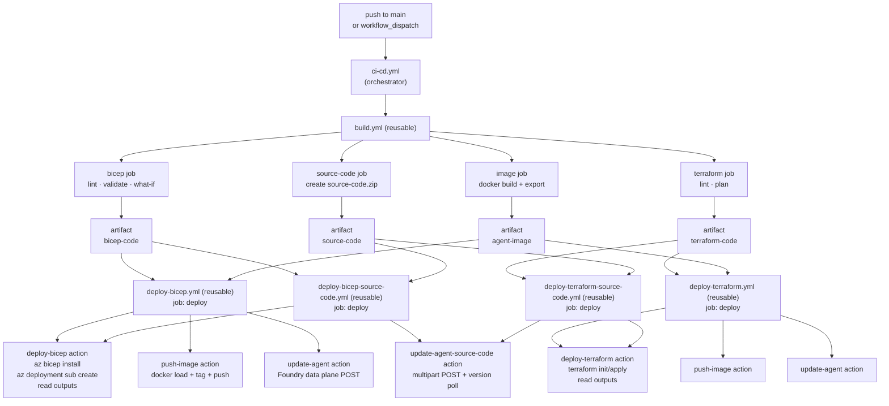

# GitHub Actions CI/CD

This guide covers the automated CI/CD pipeline for simple-hosted-agent. For local deployment, see [Deploying with Bicep](./deploy-bicep.md) or [Deploying with Terraform](./deploy-terraform.md).

---

## Workflow Architecture



Four deploy jobs (`deploy-bicep`, `deploy-terraform`, `deploy-bicep-source-code`, `deploy-terraform-source-code`) run in parallel after `build` completes. Each is independent — you can remove any job from `ci-cd.yml` if you don't need that IaC path or deployment mode.

### Agent name suffix for source-code deploys

Both source-code jobs and the image-based jobs deploy into the same Foundry project. To prevent agent-name collisions, `ci-cd.yml` automatically appends `-src` to the agent name passed to the source-code workflows. With the default `vars.AGENT_NAME = agent-framework-agent-basic-responses`, the source-code agent is registered as `agent-framework-agent-basic-responses-src`. The suffix is applied in `ci-cd.yml` only; the reusable source-code workflows accept any name verbatim when invoked standalone.

## Two deployment modes: image-based vs source-code

This repository currently supports two different hosted-agent deployment paths, and they are not interchangeable.

| Mode | What gets uploaded | REST shape | Typical use |
|---|---|---|---|
| Image-based | A container image from ACR | JSON POST to `/agents/{name}/versions?api-version=2025-11-15-preview` | Production-style container deployment with a Dockerfile |
| Source-code | A flat `.zip` of app source plus metadata | Multipart `multipart/form-data` POST to `/agents?api-version=2025-11-15-preview` | Preview source-code deployment demo and rapid iteration |

### Why the source-code path is different

The source-code path uses the preview REST contract documented by Microsoft at https://learn.microsoft.com/en-us/azure/foundry/agents/how-to/deploy-hosted-agent-code?tabs=bash. It sends two parts in one request:

1. `metadata` — the JSON agent definition (`kind`, `protocol_versions`, `code_configuration`, `environment_variables`)
2. `code` — the raw `.zip` bytes

That is why the source-code action creates a temporary metadata file before calling `curl`. The image-based path does not need that extra form part because its JSON body already contains the full definition for the container image deployment.

### Image-based vs source-code API shape

The two update actions are intentionally different because they target different API contracts.

| Action | Request target | Payload shape | Why it differs |
|---|---|---|---|
| `update-agent` | `/agents/{name}/versions?api-version=2025-11-15-preview` | Single JSON body | The image-based contract accepts the full hosted-agent definition inline, including image reference, CPU, memory, and environment variables. |
| `update-agent-source-code` | `/agents?api-version=2025-11-15-preview` on create, then version polling | Multipart form upload | The source-code contract requires a separate `metadata` JSON part and `code` zip part, plus zip-specific preview headers. |

The source-code path also uses the preview feature headers:

- `Foundry-Features: CodeAgents=V1Preview,HostedAgents=V1Preview`
- `x-ms-code-zip-sha256: <sha256-of-zip>`
- `x-ms-agent-name: <agent-name>` on create

These are part of the REST contract for the preview source-code deployment flow.

### When to use each method

- Use the image-based path when you already have a Dockerfile, need full runtime control, or want the container workflow used by the local Bicep and Terraform deploy scripts.
- Use the source-code path when you want the new preview ZIP-based deployment flow, smaller upload payloads, or fast demo iteration without building and pushing an image.
- Treat `code_configuration` and the image/container definition as mutually exclusive for a given hosted-agent version. They are different deployment modes, not interchangeable fields on the same request.

---

## Authentication Setup

The pipeline uses OpenID Connect (OIDC) federated credentials to authenticate with Azure — no long-lived secrets needed.

### Create an App Registration

```bash
az ad app create --display-name "simple-hosted-agent-cicd"
az ad sp create --id <app-id>
```

Then add two **Federated credentials** on the App Registration:

| Credential | Entity type | Value |
|---|---|---|
| main branch | Branch | `main` |
| Pull requests | Pull request | _(no value needed)_ |

For setup steps, see [Configure OIDC with GitHub Actions](https://learn.microsoft.com/azure/developer/github/connect-from-azure-oidc).

### Create Repository Secrets

Set these at **Settings → Secrets and variables → Actions → Secrets tab**:

| Secret name | Value |
|---|---|
| `AZURE_CLIENT_ID` | App Registration Application (client) ID |
| `AZURE_TENANT_ID` | Azure tenant ID |
| `AZURE_SUBSCRIPTION_ID` | Azure subscription ID |

### Assign RBAC Roles

The service principal needs the following roles. All must be assigned **at subscription scope** because the deployment creates the resource group — subscription-scoped assignments are required for resource group creation.

| Role | GUID | Scope | Reason |
|---|---|---|---|
| Contributor | `b24988ac` | Subscription | Create and manage all resources |
| User Access Administrator | `18d7d88d` | Subscription | Assign roles to managed identities in the new RG |
| Foundry Project Manager | `eadc314b` | Foundry project | Create hosted agent versions on the Foundry data plane |

> The Foundry Project Manager role must also be assigned at the **Foundry project resource scope** (not subscription). The `update-agent` step runs after infrastructure is provisioned, so the project exists at that point. The `deploy-bicep` and `deploy-terraform` workflows handle this automatically.

**For Terraform remote state only** — assign additionally:

| Role | GUID | Scope | Reason |
|---|---|---|---|
| Storage Blob Data Contributor | `ba92f5b4` | Blob container | Read and write Terraform state |

---

## Repository Secrets and Variables

### Secrets tab — sensitive credentials

| Name | Used by | Description |
|---|---|---|
| `AZURE_CLIENT_ID` | Both | OIDC: App Registration client ID |
| `AZURE_TENANT_ID` | Both | OIDC: Tenant ID |
| `AZURE_SUBSCRIPTION_ID` | Both | OIDC: Subscription ID |

### Variables tab — non-sensitive configuration

| Name | Used by | Description |
|---|---|---|
| `AZURE_ENVIRONMENT_NAME` | Bicep | Matches `environmentName` in `main.bicepparam` |
| `AZURE_LOCATION` | Bicep | Deployment region; maps to `location` param |
| `AZURE_AI_DEPLOYMENTS_LOCATION` | Bicep | Model deployment region; maps to `aiDeploymentsLocation` param |
| `TF_VAR_LOCATION` | Terraform | Deployment region; overrides `location` in `terraform.tfvars` |
| `TF_VAR_AI_DEPLOYMENTS_LOCATION` | Terraform | Model deployment region; overrides `ai_deployments_location` in `terraform.tfvars` |
| `AGENT_NAME` | Both | Agent name to register in Foundry |
| `IMAGE_NAME` | Both | Container image name (without registry prefix or tag) |
| `TF_BACKEND_RESOURCE_GROUP` | Terraform | Remote state: resource group of the storage account |
| `TF_BACKEND_STORAGE_ACCOUNT` | Terraform | Remote state: storage account name |
| `TF_BACKEND_CONTAINER` | Terraform | Remote state: blob container name |
| `TF_BACKEND_KEY` | Terraform | Remote state: blob key (state file name) |

> `TF_BACKEND_*` must be **repository variables** (Variables tab), not secrets. `vars.*` and `secrets.*` are separate GitHub Actions namespaces. Using the wrong tab causes silent empty values and the workflow falls back to ephemeral local state.

---

## Composite Action Architecture

Each deploy workflow follows the same pattern: download artifact → IaC deploy → push image → update agent. Logic is extracted to composite actions to avoid duplication.

The `deploy-bicep` and `deploy-terraform` actions surface three of the six IaC outputs (`project_endpoint`, `acr_endpoint`, `model_deployment_name`). See [IaC outputs reference](./iac-outputs.md) for the full set and why the other three aren't surfaced here.

### Artifact flow

| Artifact | Produced by | Consumed by |
|---|---|---|
| `bicep-code` | `build.yml` (bicep-lint job) | `deploy-bicep` action |
| `terraform-code` | `build.yml` (terraform-plan job) | `deploy-terraform` action |
| `agent-image` | `build.yml` (image job) | `push-image` action |
| `source-code` | `build.yml` (source-code job) | `update-agent-source-code` action |

### Composite actions

| Action | File | Purpose |
|---|---|---|
| `deploy-bicep` | [.github/actions/deploy-bicep/action.yml](../.github/actions/deploy-bicep/action.yml) | Downloads `bicep-code`, installs Bicep CLI, runs `az deployment sub create`, reads outputs |
| `deploy-terraform` | [.github/actions/deploy-terraform/action.yml](../.github/actions/deploy-terraform/action.yml) | Downloads `terraform-code`, optionally generates `backend_override.tf`, runs `terraform init/apply`, reads outputs |
| `push-image` | [.github/actions/push-image/action.yml](../.github/actions/push-image/action.yml) | Downloads `agent-image` tarball, `docker load`, `az acr login`, `docker tag/push` |
| `update-agent` | [.github/actions/update-agent/action.yml](../.github/actions/update-agent/action.yml) | POSTs the container-based hosted-agent definition to the Foundry data plane |
| `update-agent-source-code` | [.github/actions/update-agent-source-code/action.yml](../.github/actions/update-agent-source-code/action.yml) | Uploads a `.zip` plus multipart metadata for the preview source-code hosted-agent path |

### Bicep deploy job

```yaml
steps:
  - uses: actions/checkout@v6
  - uses: azure/login@v3
    with:
      client-id: ${{ secrets.AZURE_CLIENT_ID }}
      tenant-id: ${{ secrets.AZURE_TENANT_ID }}
      subscription-id: ${{ secrets.AZURE_SUBSCRIPTION_ID }}
  - uses: ./.github/actions/deploy-bicep
    id: deploy-iac
    with:
      environment_name: ${{ vars.AZURE_ENVIRONMENT_NAME }}
      location: ${{ vars.AZURE_LOCATION }}
  - uses: ./.github/actions/push-image
    with:
      acr_endpoint: ${{ steps.deploy-iac.outputs.acr_endpoint }}
      image_name: ${{ vars.IMAGE_NAME }}
  - uses: ./.github/actions/update-agent
    with:
      project_endpoint: ${{ steps.deploy-iac.outputs.project_endpoint }}
      agent_name: ${{ vars.AGENT_NAME }}
      acr_endpoint: ${{ steps.deploy-iac.outputs.acr_endpoint }}
      image_name: ${{ vars.IMAGE_NAME }}
      model_deployment_name: ${{ steps.deploy-iac.outputs.model_deployment_name }}
```

### Terraform deploy job

The Terraform job is identical in shape, with two differences:

1. ARM environment variables set at job level for the OIDC provider:

```yaml
env:
  ARM_CLIENT_ID: ${{ secrets.AZURE_CLIENT_ID }}
  ARM_TENANT_ID: ${{ secrets.AZURE_TENANT_ID }}
  ARM_SUBSCRIPTION_ID: ${{ secrets.AZURE_SUBSCRIPTION_ID }}
  ARM_USE_OIDC: "true"
```

2. `TF_BACKEND_*` variables passed to the `deploy-terraform` action:

```yaml
- uses: ./.github/actions/deploy-terraform
  id: deploy-iac
  with:
    backend_resource_group: ${{ vars.TF_BACKEND_RESOURCE_GROUP }}
    backend_storage_account: ${{ vars.TF_BACKEND_STORAGE_ACCOUNT }}
    backend_container: ${{ vars.TF_BACKEND_CONTAINER }}
    backend_key: ${{ vars.TF_BACKEND_KEY }}
```

When all four backend inputs are set, the action generates `backend_override.tf` before running `terraform init`, enabling remote state with `use_azuread_auth = true`. When any is unset, local (ephemeral) state is used.

### Source-code deploy job

The source-code deploy jobs follow the same pattern but swap the image steps for a source-code artifact download and the source-code update action:

```yaml
steps:
  - uses: actions/checkout@v6
  - uses: azure/login@v3
    with:
      client-id: ${{ secrets.AZURE_CLIENT_ID }}
      tenant-id: ${{ secrets.AZURE_TENANT_ID }}
      subscription-id: ${{ secrets.AZURE_SUBSCRIPTION_ID }}
  - uses: ./.github/actions/deploy-bicep      # or deploy-terraform
    id: deploy-iac
    with:
      environment_name: ${{ inputs.environment_name }}
      location: ${{ inputs.location }}
  - uses: actions/download-artifact@v8
    with:
      name: source-code
      path: .
  - uses: ./.github/actions/update-agent-source-code
    with:
      project_endpoint: ${{ steps.deploy-iac.outputs.project_endpoint }}
      agent_name: ${{ inputs.agent_name }}
      model_deployment_name: ${{ steps.deploy-iac.outputs.model_deployment_name }}
      zip_path: ./source-code.zip
```

For the full set of optional inputs (`cpu`, `memory`, `runtime`, `entry_point`, `max_polling_seconds`), see [Deploying Source Code](./deploy-source-code.md).

---

## Manual Trigger

`ci-cd.yml` includes a `workflow_dispatch` trigger, allowing both workflows to be run manually from **Actions → CI/CD → Run workflow**.

Inputs from `workflow_dispatch` override repository variables. This is useful for deploying to a different region or environment without changing the repo-level defaults.

---

## Running Only One IaC Path

If you only need Bicep or Terraform, remove the unused job from `ci-cd.yml`:

```yaml
# ci-cd.yml — remove the jobs you don't need
jobs:
  build:
    uses: ./.github/workflows/build.yml
    secrets: inherit

  deploy-bicep:                       # ← remove to skip image-based Bicep
    needs: build
    uses: ./.github/workflows/deploy-bicep.yml
    secrets: inherit
    with: ...

  deploy-terraform:                   # ← remove to skip image-based Terraform
    needs: build
    uses: ./.github/workflows/deploy-terraform.yml
    secrets: inherit
    with: ...

  deploy-bicep-source-code:           # ← remove to skip source-code Bicep
    needs: build
    uses: ./.github/workflows/deploy-bicep-source-code.yml
    secrets: inherit
    with: ...

  deploy-terraform-source-code:       # ← remove to skip source-code Terraform
    needs: build
    uses: ./.github/workflows/deploy-terraform-source-code.yml
    secrets: inherit
    with: ...
```

The `build.yml` workflow always runs both lint jobs, the docker build, and the source-code zip job regardless of which deploy paths you use.
