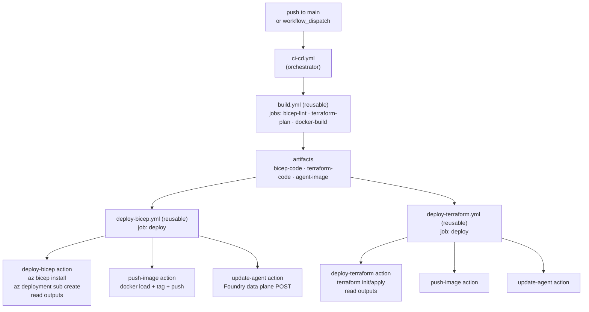

# GitHub Actions CI/CD

This guide covers the automated CI/CD pipeline for simple-hosted-agent. For local deployment, see [Deploying with Bicep](./deploy-bicep.md) or [Deploying with Terraform](./deploy-terraform.md).

---

## Workflow Architecture



`deploy-bicep` and `deploy-terraform` run in parallel after `build` completes. Each is independent — you can remove either job from `ci-cd.yml` if you only need one IaC path.

---

## Authentication Setup

The pipeline uses OpenID Connect (OIDC) federated credentials to authenticate with Azure — no long-lived secrets needed.

### Create an App Registration

```bash
az ad app create --display-name "simple-hosted-agent-cicd"
az ad sp create --id <app-id>
```

Then add two **Federated credentials** on the App Registration:

| Credential | Entity type | Value |
|---|---|---|
| main branch | Branch | `main` |
| Pull requests | Pull request | _(no value needed)_ |

For setup steps, see [Configure OIDC with GitHub Actions](https://learn.microsoft.com/azure/developer/github/connect-from-azure-oidc).

### Create Repository Secrets

Set these at **Settings → Secrets and variables → Actions → Secrets tab**:

| Secret name | Value |
|---|---|
| `AZURE_CLIENT_ID` | App Registration Application (client) ID |
| `AZURE_TENANT_ID` | Azure tenant ID |
| `AZURE_SUBSCRIPTION_ID` | Azure subscription ID |

### Assign RBAC Roles

The service principal needs the following roles. All must be assigned **at subscription scope** because the deployment creates the resource group — subscription-scoped assignments are required for resource group creation.

| Role | GUID | Scope | Reason |
|---|---|---|---|
| Contributor | `b24988ac` | Subscription | Create and manage all resources |
| User Access Administrator | `18d7d88d` | Subscription | Assign roles to managed identities in the new RG |
| Foundry Project Manager | `eadc314b` | Foundry project | Create hosted agent versions on the Foundry data plane |

> The Foundry Project Manager role must also be assigned at the **Foundry project resource scope** (not subscription). The `update-agent` step runs after infrastructure is provisioned, so the project exists at that point. The `deploy-bicep` and `deploy-terraform` workflows handle this automatically.

**For Terraform remote state only** — assign additionally:

| Role | GUID | Scope | Reason |
|---|---|---|---|
| Storage Blob Data Contributor | `ba92f5b4` | Blob container | Read and write Terraform state |

---

## Repository Secrets and Variables

### Secrets tab — sensitive credentials

| Name | Used by | Description |
|---|---|---|
| `AZURE_CLIENT_ID` | Both | OIDC: App Registration client ID |
| `AZURE_TENANT_ID` | Both | OIDC: Tenant ID |
| `AZURE_SUBSCRIPTION_ID` | Both | OIDC: Subscription ID |

### Variables tab — non-sensitive configuration

| Name | Used by | Description |
|---|---|---|
| `AZURE_ENVIRONMENT_NAME` | Bicep | Matches `environmentName` in `main.bicepparam` |
| `AZURE_LOCATION` | Bicep | Deployment region; maps to `location` param |
| `AZURE_AI_DEPLOYMENTS_LOCATION` | Bicep | Model deployment region; maps to `aiDeploymentsLocation` param |
| `TF_VAR_LOCATION` | Terraform | Deployment region; overrides `location` in `terraform.tfvars` |
| `TF_VAR_AI_DEPLOYMENTS_LOCATION` | Terraform | Model deployment region; overrides `ai_deployments_location` in `terraform.tfvars` |
| `AGENT_NAME` | Both | Agent name to register in Foundry |
| `IMAGE_NAME` | Both | Container image name (without registry prefix or tag) |
| `TF_BACKEND_RESOURCE_GROUP` | Terraform | Remote state: resource group of the storage account |
| `TF_BACKEND_STORAGE_ACCOUNT` | Terraform | Remote state: storage account name |
| `TF_BACKEND_CONTAINER` | Terraform | Remote state: blob container name |
| `TF_BACKEND_KEY` | Terraform | Remote state: blob key (state file name) |

> `TF_BACKEND_*` must be **repository variables** (Variables tab), not secrets. `vars.*` and `secrets.*` are separate GitHub Actions namespaces. Using the wrong tab causes silent empty values and the workflow falls back to ephemeral local state.

---

## Composite Action Architecture

Each deploy workflow follows the same pattern: download artifact → IaC deploy → push image → update agent. Logic is extracted to composite actions to avoid duplication.

The `deploy-bicep` and `deploy-terraform` actions surface three of the six IaC outputs (`project_endpoint`, `acr_endpoint`, `model_deployment_name`). See [IaC outputs reference](./iac-outputs.md) for the full set and why the other three aren't surfaced here.

### Artifact flow

| Artifact | Produced by | Consumed by |
|---|---|---|
| `bicep-code` | `build.yml` (bicep-lint job) | `deploy-bicep` action |
| `terraform-code` | `build.yml` (terraform-plan job) | `deploy-terraform` action |
| `agent-image` | `build.yml` (docker-build job) | `push-image` action |

### Composite actions

| Action | File | Purpose |
|---|---|---|
| `deploy-bicep` | [.github/actions/deploy-bicep/action.yml](../.github/actions/deploy-bicep/action.yml) | Downloads `bicep-code`, installs Bicep CLI, runs `az deployment sub create`, reads outputs |
| `deploy-terraform` | [.github/actions/deploy-terraform/action.yml](../.github/actions/deploy-terraform/action.yml) | Downloads `terraform-code`, optionally generates `backend_override.tf`, runs `terraform init/apply`, reads outputs |
| `push-image` | [.github/actions/push-image/action.yml](../.github/actions/push-image/action.yml) | Downloads `agent-image` tarball, `docker load`, `az acr login`, `docker tag/push` |
| `update-agent` | [.github/actions/update-agent/action.yml](../.github/actions/update-agent/action.yml) | POSTs to Foundry data plane; captures HTTP status and error body separately for visible diagnostics |

### Bicep deploy job

```yaml
steps:
  - uses: actions/checkout@v6
  - uses: azure/login@v3
    with:
      client-id: ${{ secrets.AZURE_CLIENT_ID }}
      tenant-id: ${{ secrets.AZURE_TENANT_ID }}
      subscription-id: ${{ secrets.AZURE_SUBSCRIPTION_ID }}
  - uses: ./.github/actions/deploy-bicep
    id: deploy-iac
    with:
      environment_name: ${{ vars.AZURE_ENVIRONMENT_NAME }}
      location: ${{ vars.AZURE_LOCATION }}
  - uses: ./.github/actions/push-image
    with:
      acr_endpoint: ${{ steps.deploy-iac.outputs.acr_endpoint }}
      image_name: ${{ vars.IMAGE_NAME }}
  - uses: ./.github/actions/update-agent
    with:
      project_endpoint: ${{ steps.deploy-iac.outputs.project_endpoint }}
      agent_name: ${{ vars.AGENT_NAME }}
      acr_endpoint: ${{ steps.deploy-iac.outputs.acr_endpoint }}
      image_name: ${{ vars.IMAGE_NAME }}
      model_deployment_name: ${{ steps.deploy-iac.outputs.model_deployment_name }}
```

### Terraform deploy job

The Terraform job is identical in shape, with two differences:

1. ARM environment variables set at job level for the OIDC provider:

```yaml
env:
  ARM_CLIENT_ID: ${{ secrets.AZURE_CLIENT_ID }}
  ARM_TENANT_ID: ${{ secrets.AZURE_TENANT_ID }}
  ARM_SUBSCRIPTION_ID: ${{ secrets.AZURE_SUBSCRIPTION_ID }}
  ARM_USE_OIDC: "true"
```

2. `TF_BACKEND_*` variables passed to the `deploy-terraform` action:

```yaml
- uses: ./.github/actions/deploy-terraform
  id: deploy-iac
  with:
    backend_resource_group: ${{ vars.TF_BACKEND_RESOURCE_GROUP }}
    backend_storage_account: ${{ vars.TF_BACKEND_STORAGE_ACCOUNT }}
    backend_container: ${{ vars.TF_BACKEND_CONTAINER }}
    backend_key: ${{ vars.TF_BACKEND_KEY }}
```

When all four backend inputs are set, the action generates `backend_override.tf` before running `terraform init`, enabling remote state with `use_azuread_auth = true`. When any is unset, local (ephemeral) state is used.

---

## Manual Trigger

`ci-cd.yml` includes a `workflow_dispatch` trigger, allowing both workflows to be run manually from **Actions → CI/CD → Run workflow**.

Inputs from `workflow_dispatch` override repository variables. This is useful for deploying to a different region or environment without changing the repo-level defaults.

---

## Running Only One IaC Path

If you only need Bicep or Terraform, remove the unused job from `ci-cd.yml`:

```yaml
# ci-cd.yml — remove the job you don't need
jobs:
  build:
    uses: ./.github/workflows/build.yml
    secrets: inherit

  deploy-bicep:            # ← remove this block to skip Bicep
    needs: build
    uses: ./.github/workflows/deploy-bicep.yml
    secrets: inherit
    with: ...

  deploy-terraform:        # ← remove this block to skip Terraform
    needs: build
    uses: ./.github/workflows/deploy-terraform.yml
    secrets: inherit
    with: ...
```

The `build.yml` workflow always runs both lint jobs and the docker build regardless of which deploy path you use.
