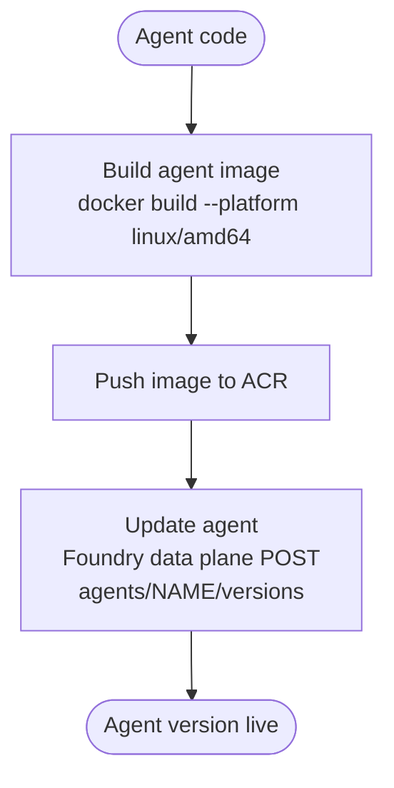

# REST API CI/CD — Agent Deployment

> This page supports a specific blog post and lives only on this branch.

This guide outlines the **agent deployment process**: building the agent into a
container image, publishing it to Azure Container Registry (ACR), and
registering a new hosted agent version through the **Foundry data plane REST
API**. Infrastructure provisioning is out of scope here — this focuses purely on
getting agent code into a running Foundry hosted agent.



---

## 1. Build the agent image

The agent is a Python app built on the Agent Framework, served by
`ResponsesHostServer` on port `8088`. It is packaged from
[src/agent-framework/responses/basic/Dockerfile](../src/agent-framework/responses/basic/Dockerfile):

```dockerfile
FROM python:3.12-slim
WORKDIR /app
COPY . user_agent/
WORKDIR /app/user_agent
RUN pip install -r requirements.txt
EXPOSE 8088
CMD ["python", "main.py"]
```

Build the image, always targeting `linux/amd64` — the Foundry runtime does not
support arm64, so building on Apple Silicon without this flag produces a
platform mismatch at container start:

```bash
docker build \
  --platform linux/amd64 \
  --tag agent-framework-basic-responses:<tag> \
  --file src/agent-framework/responses/basic/Dockerfile \
  src/agent-framework/responses/basic
```

> The image tag is the short commit SHA on a push (`${GITHUB_SHA::7}`), or
> `pr{number}a{run_attempt}` on a pull request. This tag flows through to the
> ACR push and the data plane call so every version is traceable to a commit.

---

## 2. Push the image to ACR

Authenticate to the registry with the managed identity / OIDC session already
established in the deploy job, then tag and push:

```bash
az acr login --name <registry>          # registry = ACR endpoint without .azurecr.io
docker tag agent-framework-basic-responses:<tag> <registry>.azurecr.io/<image>:<tag>
docker push <registry>.azurecr.io/<image>:<tag>
```

No stored credentials are used anywhere — ACR access is brokered through the
authenticated Azure session.

---

## 3. Update the agent via the Foundry data plane

A new hosted agent version is created with a single `POST` to the Foundry data
plane. This is **not** done through `az cognitiveservices agent create` (which
calls a broken start operation for hosted agents) — it is a direct REST call.

### Acquire a token

The call must be authorized for the `https://ai.azure.com/` audience — not
`cognitiveservices.azure.com`:

```bash
FOUNDRY_TOKEN=$(az account get-access-token \
  --resource "https://ai.azure.com/" \
  --query accessToken -o tsv)
```

### Build the request body

```json
{
  "metadata": { "enableVnextExperience": "true" },
  "definition": {
    "kind": "hosted",
    "container_protocol_versions": [{ "protocol": "responses", "version": "1.0.0" }],
    "cpu": "0.25",
    "memory": "0.5Gi",
    "environment_variables": { "AZURE_AI_MODEL_DEPLOYMENT_NAME": "<model>" },
    "image": "<registry>.azurecr.io/<image>:<tag>"
  }
}
```

> `metadata.enableVnextExperience: "true"` is a hard server-side requirement —
> omitting it causes a silent failure.

`AZURE_AI_MODEL_DEPLOYMENT_NAME` must be set explicitly in the request body — it
is **not** injected automatically by the runtime (unlike `FOUNDRY_PROJECT_ENDPOINT`
and `APPLICATIONINSIGHTS_CONNECTION_STRING`, which are).

### Post the version

```bash
curl -s -X POST \
  "${PROJECT_ENDPOINT}/agents/${AGENT_NAME}/versions?api-version=2025-11-15-preview" \
  -H "Authorization: Bearer ${FOUNDRY_TOKEN}" \
  -H "Content-Type: application/json" \
  -d "${AGENT_REQUEST_BODY}"
```

A successful response (HTTP 2xx) returns the new `version` ID. The hosted agent
then pulls the image from ACR and starts the container — the new version is
live.

---

## Reference

These steps map directly to the composite actions used by the Bicep deploy
workflow:

| Step | Action |
|---|---|
| Build image | [build.yml](../.github/workflows/build.yml) (`image` job) |
| Push to ACR | [.github/actions/push-image/action.yml](../.github/actions/push-image/action.yml) |
| Update agent | [.github/actions/update-agent/action.yml](../.github/actions/update-agent/action.yml) |
