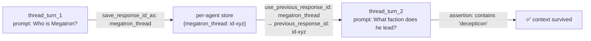

# Smoke Tests

This guide covers the post-deploy smoke test suite that validates a deployed Foundry hosted agent's behavior via its Responses endpoint. The suite is invoked automatically by both shell scripts and by GitHub Actions, and can also be run on demand against any deployed agent.

For local deployment, see [Deploying with Bicep](./deploy-bicep.md) or [Deploying with Terraform](./deploy-terraform.md). For CI/CD, see [GitHub Actions CI/CD](./github-actions.md).

---

## What the smoke tests validate

The suite has two jobs:

1. **Reachability** — confirm the agent's Responses data-plane endpoint accepts requests and returns a well-formed OpenAI-Responses payload (`output_text` or `output[*].content[*].text`).
2. **System-prompt rule compliance** — confirm the agent obeys the rules declared in [main.py](../src/agent-framework/responses/basic/main.py). The sample agent is a Transformers expert with four numbered rules: off-topic refusal, no fabrication, continuity awareness, and brevity.

Each test is a `(prompt, assertions)` pair. Assertions are **case-insensitive substring checks** on the returned text. Tests run sequentially per agent; passing all six is the deploy contract.

---

## File layout

| File | Purpose |
|---|---|
| [deployment/smoke-tests.json](../deployment/smoke-tests.json) | The test catalog — list of prompts and assertions |
| [deployment/smoke-tests.py](../deployment/smoke-tests.py) | The runner — stdlib only, no pip dependencies |
| [.github/actions/smoke-test/action.yml](../.github/actions/smoke-test/action.yml) | Composite action wrapping the runner for CI |

---

## Test catalog

The catalog is a JSON document with one `tests` array. Each entry has the following shape:

```json
{
  "id": "string — unique test name",
  "description": "string — human-readable purpose",
  "prompt": "string — the message sent to the agent",
  "assertions": {
    "status":        200,            // optional, HTTP status; default 200
    "contains_any":  ["...", "..."], // optional, at least one must match
    "contains_all":  ["...", "..."], // optional, all must match
    "contains_none": ["...", "..."]  // optional, none may match
  },
  "save_response_id_as":      "string — optional, store response.id under this key",
  "use_previous_response_id": "string — optional, send previous_response_id from the named key"
}
```

All substring matches are case-insensitive. Assertion keys are evaluated independently; missing keys are skipped, not failed.

### Multi-turn threading

`save_response_id_as` and `use_previous_response_id` provide a per-agent key/value store of response IDs. A test that saves an ID under `"megatron_thread"` can be followed by another test that sends `previous_response_id` from `"megatron_thread"`. The store is reset between agents — agents do not share threading state.



### Current test cases

The six bundled tests map to system-prompt rules as follows:

| ID | Rule covered | Asserts |
|---|---|---|
| `basic_response` | (none — reachability) | Reply contains `optimus` or `prime` |
| `thread_turn_1` | (none — primes the thread) | Reply contains `megatron`, saves response ID |
| `thread_turn_2` | Threading works | Reply to "What faction does he lead?" contains `decepticon` (only correct if context survived) |
| `offtopic_refusal` | Rule 1 — off-topic refusal | Reply contains `only answer questions about transformers` and does **not** contain `paris` |
| `no_hallucination` | Rule 2 — no fabrication | Reply contains an honest-rejection marker (`i don't know`, `not certain`, `no such`, `no storyline`, `does not`, `doesn't`, `did not`, `didn't`, `never happens`, …) |
| `continuity_aware` | Rule 3 — continuity disclosure | Reply contains `continuity`, `depends`, `differs`, `varies`, … |

Rule 4 (brevity) is intentionally not asserted — length-based assertions tend to be flaky across model versions.

---

## Runner

[deployment/smoke-tests.py](../deployment/smoke-tests.py) is a single-file Python script with no third-party dependencies (stdlib only — `argparse`, `json`, `urllib`, `subprocess`).

### CLI

```text
smoke-tests.py
  --project-endpoint URL         (required) Foundry project endpoint
  --agent-name NAME              (required, repeatable) Agent to test; repeat to test more than one
  --tests-file PATH              (optional) JSON catalog (default: ./smoke-tests.json next to the script)
  --timeout SECONDS              (optional) Per-request timeout (default: 120)
```

Each `--agent-name` runs the full catalog against that agent. Per-agent results are summarised at the end. Exit code is **0** when every test passes for every agent, **1** if any test failed, **2** for runner errors (missing tests file, token acquisition failure).

### Example

```bash
python3 deployment/smoke-tests.py \
  --project-endpoint "https://ai-account-xxx.services.ai.azure.com/api/projects/ai-project" \
  --agent-name agent-framework-agent-basic-responses \
  --agent-name agent-framework-agent-basic-responses-src
```

### Authentication

The runner requires a bearer token scoped to the Foundry data plane (`https://ai.azure.com/`). Token acquisition order:

1. If the `FOUNDRY_TOKEN` environment variable is set, it is used verbatim. This is how CI passes a pre-acquired token and how callers can override the default.
2. Otherwise the runner shells out to `az account get-access-token --resource https://ai.azure.com/` and uses the returned token. This is what happens locally — you must have run `az login` first.

The runner does **not** use `az rest` — that command does not reliably acquire the correct audience token for the Foundry data plane.

### Response-shape tolerance

The runner accepts both shapes the Responses endpoint can return:

- `payload["output_text"]` — flat string convenience field
- `payload["output"][*]["content"][*]["text"]` — structured output array, joined with newlines

If neither is present, the assertion text is empty and any `contains_*` rule will fail with a readable preview of the raw response.

---

## Running locally

### As part of a deploy

Both shell scripts invoke the runner as Step 8 by default. See [Deploying with Bicep](./deploy-bicep.md#what-each-step-does) and [Deploying with Terraform](./deploy-terraform.md#what-each-step-does) for the integration details.

### Standalone

To re-run smoke tests against an already-deployed agent without re-deploying:

```bash
# Get the project endpoint from your IaC outputs
PROJECT_ENDPOINT=$(az cognitiveservices account show \
  --name <ai-account> --resource-group <rg> \
  --query 'properties.endpoints["AI Foundry API"]' -o tsv)/api/projects/<project-name>

python3 deployment/smoke-tests.py \
  --project-endpoint "$PROJECT_ENDPOINT" \
  --agent-name agent-framework-agent-basic-responses-src
```

For Terraform users, `terraform output -raw AZURE_AI_PROJECT_ENDPOINT` (run from `infra/terraform/`) prints the value directly.

---

## In CI

The `smoke-test` composite action ([action.yml](../.github/actions/smoke-test/action.yml)) wraps the runner for GitHub Actions. It runs **four times per pipeline** — once per agent variant × IaC tool:

| Workflow | Job | Agent name passed |
|---|---|---|
| `deploy-bicep.yml` | `update-agent` | `${{ inputs.agent_name }}` |
| `deploy-bicep.yml` | `update-agent-source-code` | `${{ inputs.agent_name }}-src` |
| `deploy-terraform.yml` | `update-agent` | `${{ inputs.agent_name }}` |
| `deploy-terraform.yml` | `update-agent-source-code` | `${{ inputs.agent_name }}-src` |

The smoke step is the **last step** of each update job. A smoke failure fails that single update job — parallel jobs (the other agent variant, or the other IaC tool entirely) continue running independently. See [GitHub Actions — Smoke tests in CI](./github-actions.md#smoke-tests-in-ci) for the full job context.

The composite action assumes the caller has already run `actions/checkout@v6` (so the runner script and catalog are on disk) and `azure/login@v3` (so the runner can call `az account get-access-token`). It does not perform either itself.

---

## Adding a new test

1. Add a new entry to the `tests` array in [smoke-tests.json](../deployment/smoke-tests.json). Pick a unique `id`.
2. Keep assertions **broad enough to cover any reasonable phrasing** the agent might use. The original `no_hallucination` test only matched `does not happen` / `did not happen`; the agent answered with `does not marry` and `no storyline` and the test failed. Broadening `contains_any` to include `does not`, `doesn't`, `no storyline`, etc. fixed it.
3. Run the runner locally against your deployed agent (see [Standalone](#standalone)) until 6/6 (or N/N) passes.
4. Commit. CI will pick up the change automatically — the runner reads the catalog at runtime from the checked-out repo.

To assert HTTP failure instead of a 200, set `"assertions": {"status": 4xx}`. To pin negative semantics, combine `contains_any` (must include an honest marker) with `contains_none` (must not include the off-topic answer), as the `offtopic_refusal` test does.

---

## Troubleshooting

| Failure | Likely cause | Fix |
|---|---|---|
| All tests time out | Agent is cold-starting; first request can take longer than 120s | Re-run, or pass `--timeout 180` |
| One test asserts `contains_any` but the response is reasonable | Assertion list is too narrow for the way the model phrased its answer | Broaden the `contains_any` list. See the `no_hallucination` history. |
| `HTTP 404` on every test | Agent name does not exist in the project | Check spelling; image-based vs source-code agents use different names (`-src` suffix for source-code in this repo's deploy scripts and CI) |
| `HTTP 401/403` | Token has the wrong audience, or RBAC has not propagated | Make sure you ran `az login` and have **Foundry Project Manager** at the project scope. If the deploy script ran with `--skip-rbac`, the step prints a warning. |
| Runner exits with code 2 immediately | `smoke-tests.json` not found, or `az` not on `PATH` | Check the `--tests-file` path; install or login with Azure CLI |
| `contains_any: none of [...] found` with a preview that looks correct | Substring matching is case-insensitive but exact — punctuation or whitespace differences can still miss | Add the literal phrasing the agent used to the list |
